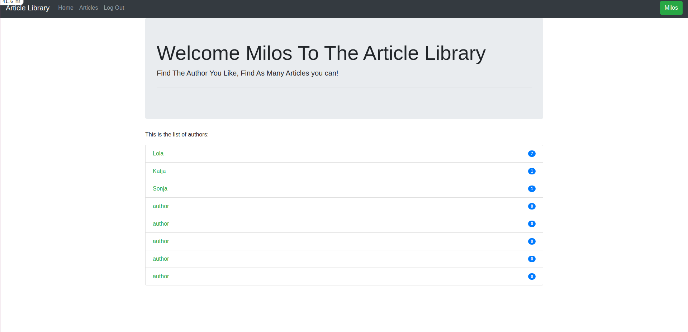

# Article Application

> This project represent my Article Application. User can Sign Up as author or reader. As Author user can write articles.Reader can read and like articles.It is build with Rails and styled with Bootstrap.

## Built With

- Ruby
- Ruby on Rails
- Bootstrap

## Getting Started

###### First get a copy of the project by clicking on the green button on the top right corner
###### On your local machine run this command `git@github.com:410AngelaVu/articles_app.git`
###### Then type `cd articles_app` and that will get you inside the project.
###### Then run bundle install
###### Run db:migrate
###### Run db:seed 
###### Sign Up
###### To open in server, go to the browser and type localhost:3000

## To install Bootstrap in Rails:

- Go to your Terminal and put this:

- yarn add bootstrap jquery popper.js

### Prerequisites

- Need to have Ruby install
- Rails

### Usage

- Sign Up to a new account and read exciting articles!

## Author

👤 **Gia Vu**

- GitHub: [https://github.com/410AngelaVu]
- Twitter: [https://twitter.com/andjelavukadin7]
- LinkedIn: [https://www.linkedin.com/in/andjela-vukadinovic-67a21b1b2/]

